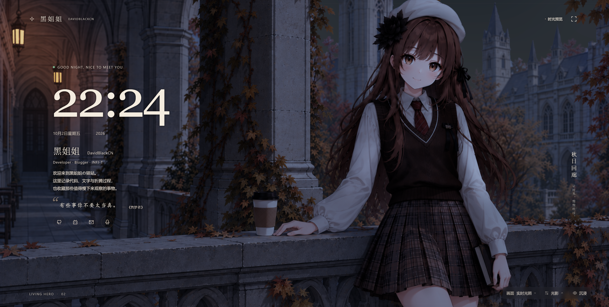

# DB Living Hero

一个可独立部署的插画场景主页：真实本地时钟、连续昼夜光照、角色微动效与秋日落叶。使用 **Vue 3 + TypeScript + 原生 WebGL2 + Vite**，不依赖在线渲染服务。



## 使用

Node 24，pnpm 10.28.2（见 `.nvmrc` / `package.json`）：

```sh
pnpm install
pnpm dev
pnpm typecheck
pnpm build
pnpm preview
```

将 `dist/` 的全部内容部署到静态 HTTP(S) 服务器即可，支持根目录和子路径。不要用 `file://` 直接打开。运行资源全部位于 `public/assets/hero/`；`sources/`、`docs/` 和 `scripts/` 不参与网页部署。

## 页面与交互

- 大时钟和问候语显示真实本地时间；光影面板可独立预览 Dawn / Noon / Dusk / Night 或播放 24H。
- 右下角单排工具栏提供画面选择、两级向上展开的光影菜单和沉浸模式。
- 光影参数手动调整后，可恢复昼夜自动值。画面支持 Lit / Base / Normal。
- `H` 切换沉浸模式；保留左侧时钟与介绍，只隐藏外围界面。`Esc` 优先收起当前菜单，再退出沉浸。
- 社交图标为展示占位，没有实际跳转；页面没有下滑内容。
- 入场先呈现底图，再过渡到 Lit；WebGL 不可用时保留底图。

## 实现与边界

底图和注册 Normal 描述固定二维插画，太阳/月亮方向驱动角色与建筑受光；局部暖灯、天空重建和 Atmosphere 完成场景合成。Blink 使用局部双眼连续混合；呼吸与头发共享角色坐标链；Leaves 使用独立 Canvas2D。它不是通用 3D 或 Live2D 系统，换插画需要重新注册素材。

高质量保留完整效果；其他档位控制 DPR、像素预算和动效数量。后台、离屏和 reduced-motion 受到生命周期控制。移动竖屏保留完整原画，可能有留白。具体预算见 [组件接入文档](docs/VUEPRESS_INTEGRATION.md)。

## 目录与维护

| 目录 | 用途 |
| --- | --- |
| `src/app/` | 独立主页、文案、交互和样式 |
| `src/components/` | LivingHero、渲染宿主和可选 DebugPanel |
| `src/engine/`、`src/shaders/`、`src/config/` | 渲染、动画、时段参数与注册配置 |
| `public/assets/hero/` | 当前实际运行的 20 张素材 |
| `sources/hero/` | Normal / Blink / Sky 必需的离线制作输入，不部署 |
| `scripts/` | 有效的资产生成、校验与组件/页面回归工具 |
| `docs/validation/` | 精选最终验收资料及像素回归基准 |
| `artifacts/` | 本地自动生成的截图、报告；Git 忽略 |

- [当前状态](docs/STAGE_CHECKPOINT.md)
- [架构与动画](docs/ANIMATION_PLAN.md)
- [素材注册与生成](docs/ASSET_PLAN.md)
- [VuePress / Plume 接口](docs/VUEPRESS_INTEGRATION.md)（尚未进行实际宿主联调）
- [验收与回归入口](docs/validation/README.md)
- [仓库维护规则与本次清理](docs/MAINTENANCE.md)

历史迭代图和过期报告已从工作树移除，需要追溯时查看 Git 历史，不再在目录里并存多轮候选。
