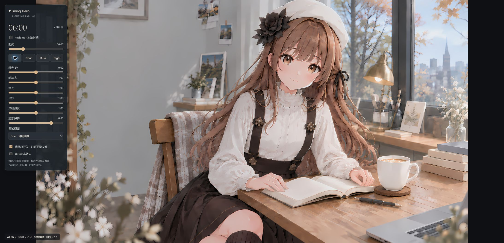
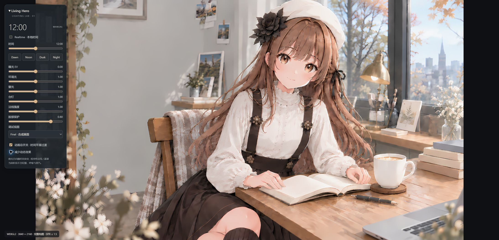
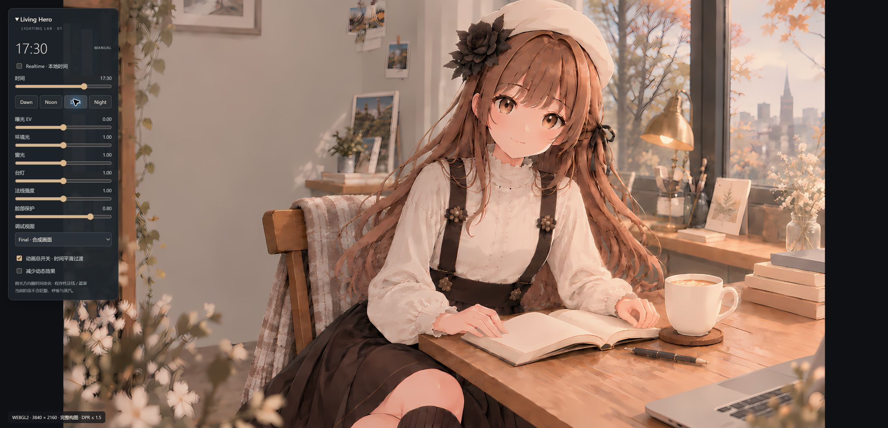
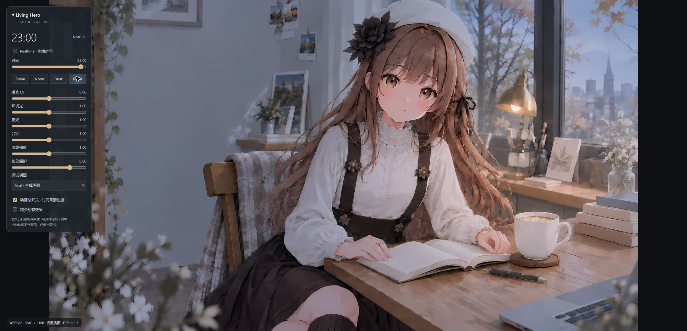

# Phase 1 visual validation

These are retained baseline captures. See [Phase 2](phase2/README.md) for the current rendering and same-viewport comparison.

Actual Edge browser screenshots, default lighting values, full composition. JPEG bytes are saved as `.jpg` without repainting. The debug panel is included to show the time and control values.

| Dawn · 06:00 | Noon · 12:00 |
| --- | --- |
|  |  |

| Dusk · 17:30 | Night · 23:00 |
| --- | --- |
|  |  |

Additional diagnostic captures: `debug-normal.jpg`, `debug-masks.jpg`.

To reproduce: `npm run dev`, open the root page, use default strengths, Final view, realtime off, click each named preset and wait until the large rendered clock reaches the target before capturing. Keep the same viewport and panel state across all four shots. Update these images after a major shader or lighting change.

`source-preview.jpg` is a 1200×675 downscaled source inspection image, not a rendering validation screenshot.
