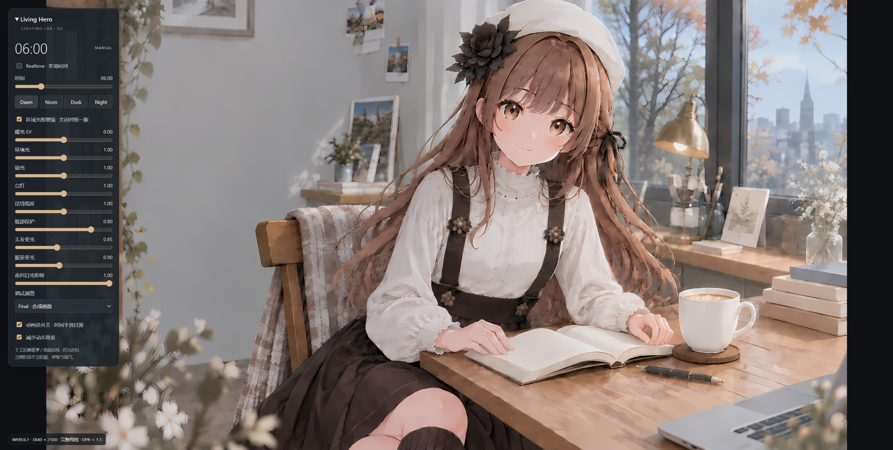
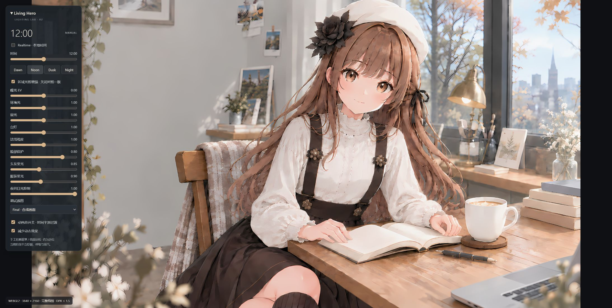
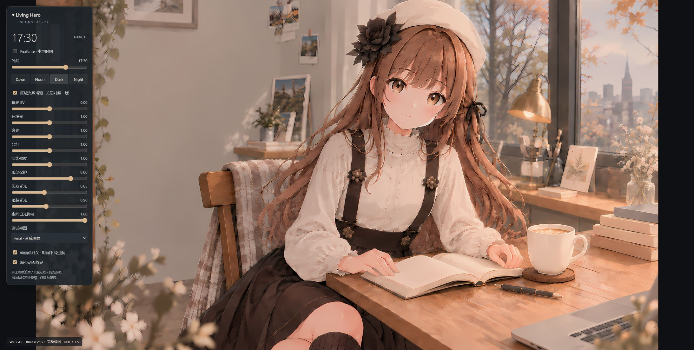
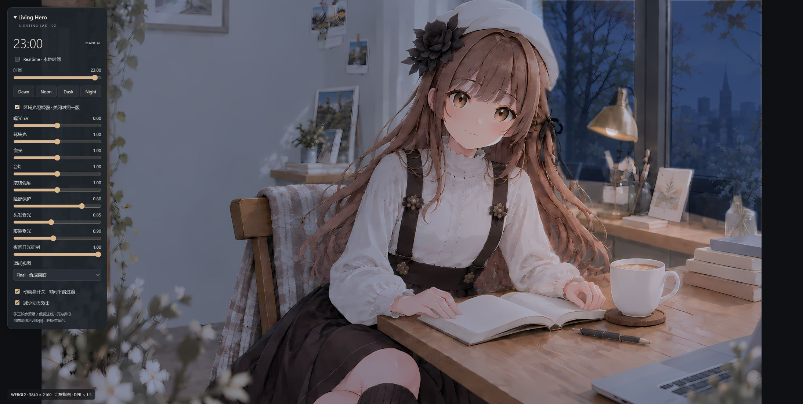
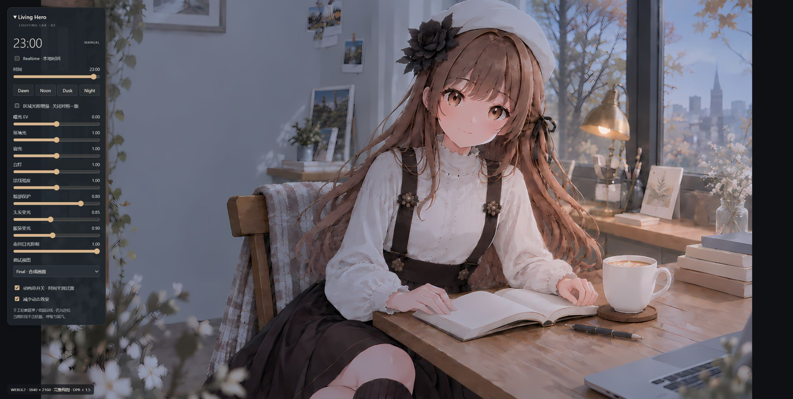

# Phase 2 visual validation

实际 Edge / WebGL2 截图，2187×1103，同一视口与默认照明参数。减少动态效果开启，仅用于直接到达目标时间。原图完整等比显示。

| Dawn · 06:00 | Noon · 12:00 |
| --- | --- |
|  |  |

| Dusk · 17:30 | Night · 23:00 |
| --- | --- |
|  |  |

## 相同时间的一版／二版对照

| 区域增强关闭 | 区域增强开启 |
| --- | --- |
|  |  |

另见 `normal.jpg` 与 `overlay.jpg`，检查技术资产方向与轮廓配准。

复现：`npm run dev` → 根页面 → 减少动态效果 → 点击对应预设 → 确认大时钟到达目标。切换「区域光照增强」做同一时间对照。修改轮廓后先 `npm run assets:generate`，再刷新页面。主 shader 或光照参数改变后重新保存这一组截图。
