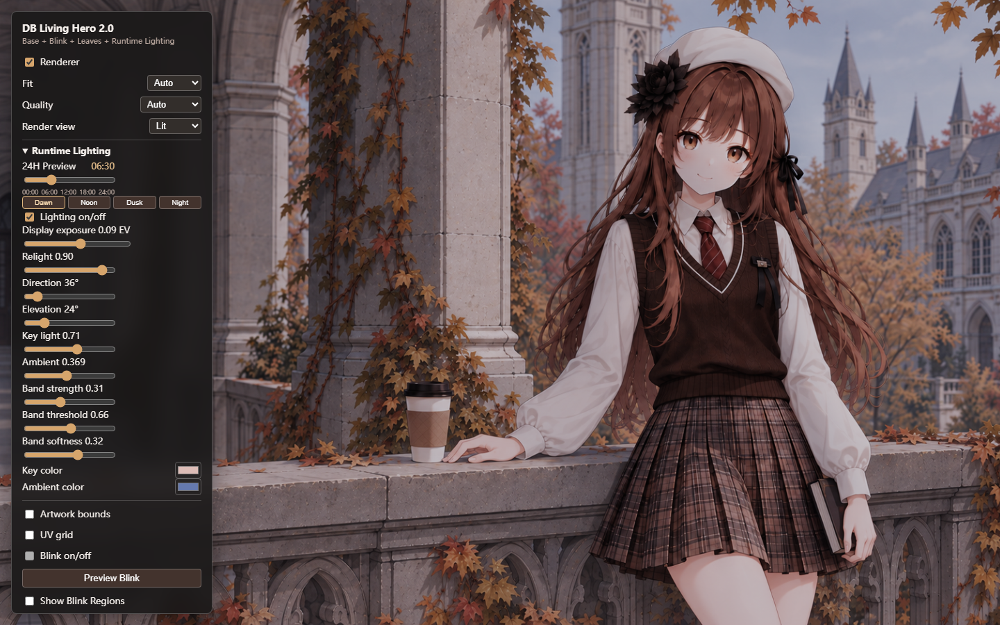
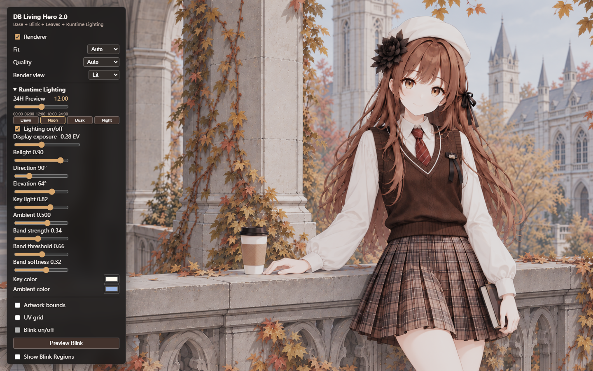
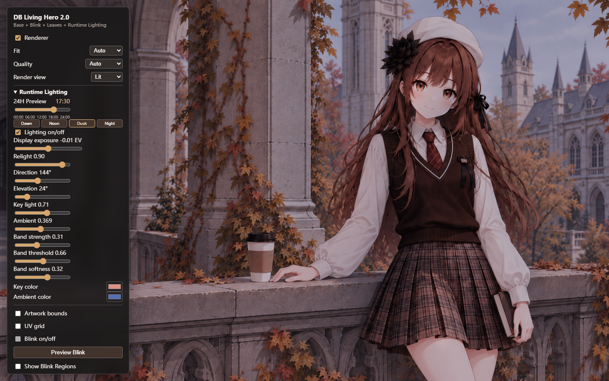
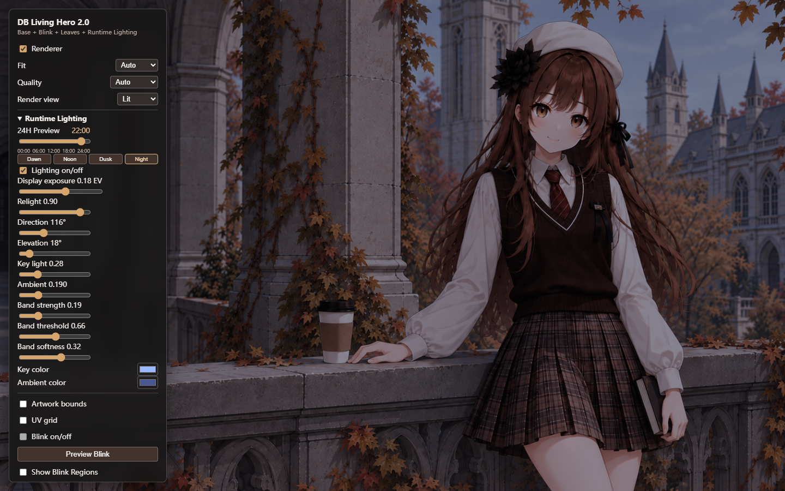

# R2A.3 Four-Anchor Luminance & Color Calibration

## Scope

R2A.3 calibrates the existing continuous `lightingFor(minutes)` model at 06:30, 12:00, 17:30, and 22:00. It does not change Base Albedo, Normal v3, Artwork Space, slider structure, solar trajectory, sunrise/sunset, or the Vue/engine boundary. No R2B clock sync/playback, post effects, masks, or animation work is included.

## Calibrated Model Values

Values below are from `lightingModelConfig` in `src/config/lighting.ts`. Direction and displayed state are evaluated at the anchor minute; key/ambient colors are linear RGB multipliers.

| Anchor | Direction azimuth / elevation | Exposure | Key / ambient intensity | Key color | Ambient color | Band strength |
| --- | ---: | ---: | ---: | --- | --- | ---: |
| Dawn 06:30 | 36° / 24° | +0.09 EV | 0.71 / 0.37 | `[0.866, 0.737, 0.715]` | `[0.394, 0.475, 0.681]` | 0.31 |
| Noon 12:00 | 90° / 64° | -0.28 EV | 0.82 / 0.50 | `[1.000, 0.980, 0.940]` | `[0.600, 0.700, 0.880]` | 0.34 |
| Dusk 17:30 | 144° / 24° | -0.01 EV | 0.71 / 0.37 | `[0.866, 0.572, 0.522]` | `[0.338, 0.435, 0.704]` | 0.31 |
| Night 22:00 | 116° / 18° | +0.18 EV | 0.28 / 0.19 | `[0.600, 0.730, 1.000]` | `[0.280, 0.340, 0.580]` | 0.19 |

Shared stylized diffuse values: wrap `0.08`, threshold `0.52`, softness `0.24`; band threshold `0.66`, softness `0.32`; relight strength `0.90`. Band strength scales continuously with daylight and twilight warmth.

## Page Review

Chromium / WebGL2 screenshots were checked at 1440x900 for 00:00, 06:30, 09:00, 12:00, 15:00, 17:30, 20:00, and 22:00. Core anchor captures are archived here:

| Dawn | Noon |
| --- | --- |
|  |  |
| Dusk | Night |
|  |  |

Observed: Noon is the brightest and remains clean, with shirt folds and face detail retained. Dawn reads cooler in the environment with a restrained warm key and is visibly more readable than Night. Dusk has the opposite, warmer key direction with cool fill still present; it is darker than Dawn and should be reviewed for whether that depth is desirable. Night is distinctly darkest, cool ambient-led, with the face still readable and normal-driven form present. Faces do not show an obvious embossed boundary or plastic highlight. Dawn/Dusk color separation is present but subtle at whole-scene scale; manual acceptance is still required before freezing the baseline.

## Offline Luminance Diagnostic

Run with `python scripts/diagnose_lighting_screenshots.py --directory docs/validation/r2a3-screenshots`. It linearizes screenshot sRGB and reports mean / p95 / p99 luminance plus near-white pixel percentage for the full frame and fixed offline ROIs. Screenshot ROIs are diagnostics only, not runtime masks.

| Time | Full mean | Full p95 | Full p99 | Face mean | Shirt mean | Architecture mean | Shirt near-white |
| --- | ---: | ---: | ---: | ---: | ---: | ---: | ---: |
| 06:30 | 0.1204 | 0.3825 | 0.4741 | 0.1184 | 0.1919 | 0.1355 | 0% |
| 12:00 | 0.2436 | 0.6338 | 0.7011 | 0.2424 | 0.3749 | 0.2965 | 0% |
| 17:30 | 0.1008 | 0.3301 | 0.4229 | 0.1033 | 0.1621 | 0.1059 | 0% |
| 22:00 | 0.0527 | 0.1753 | 0.4229 | 0.0507 | 0.0795 | 0.0477 | 0% |

The ordering is `Noon > Dawn > Dusk > Night`. The full-frame near-white metric includes the Debug UI and must not be interpreted as artwork clipping; the measured face, shirt, and architecture ROIs had 0% near-white pixels. Noon shirt p95/p99 are `0.6939` / `0.7068`, with no clipped near-white pixels in the shirt ROI.

## Continuity and Invariants

Minute-by-minute sampling from 00:00 through 24:00 showed no discontinuity. Maximum adjacent-minute deltas were 0.0048 EV, 0.0116 key intensity, 0.0046 ambient intensity, 0.0033 band strength, 0.0124 for a key-color channel, and 0.0034 for an ambient-color channel. The 00:00 and 24:00 states match exactly. Base and Lighting-off Lit matched pixel-for-pixel (maximum RGBA channel difference: 0) in the browser check.

`pnpm build` passes. Engineering and diagnostic checks are complete; this is submitted for manual visual acceptance. Do not start R2B until explicitly accepted.
