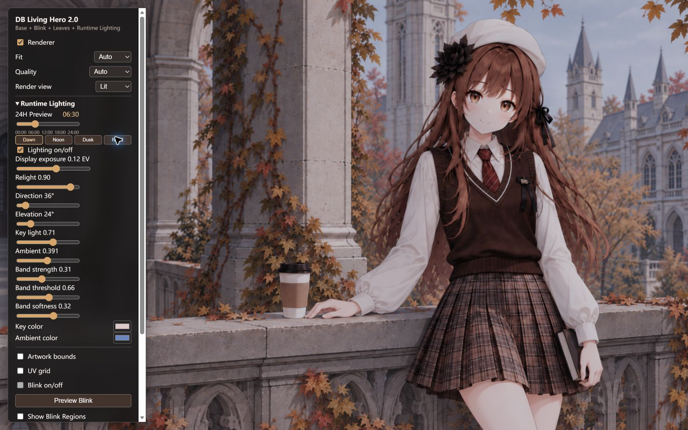
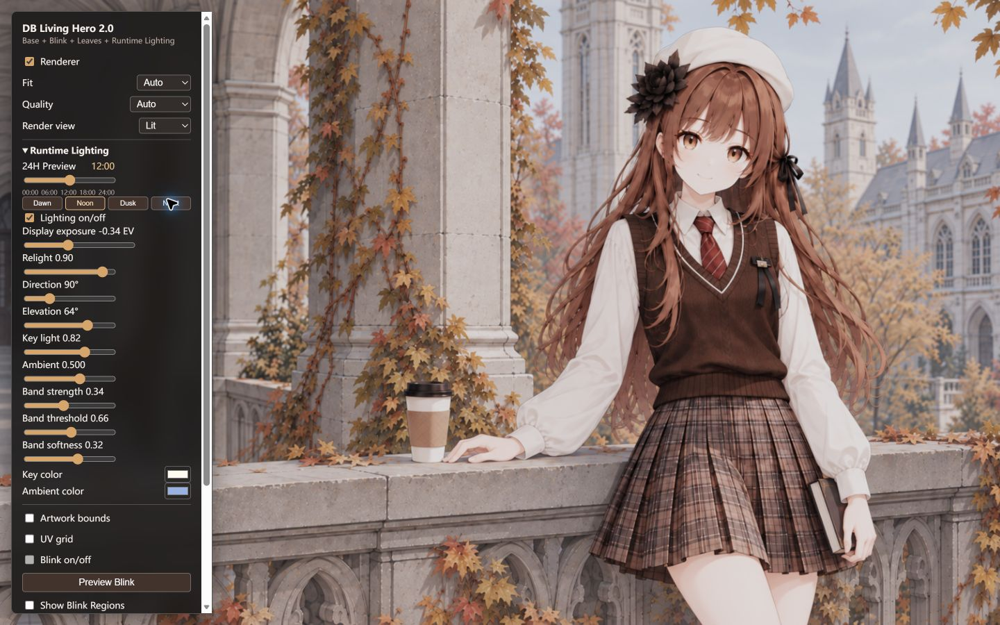
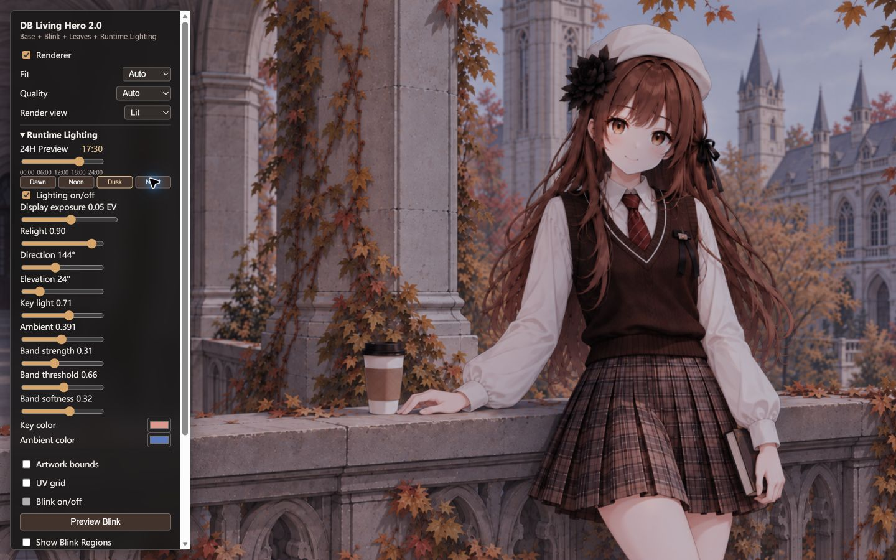
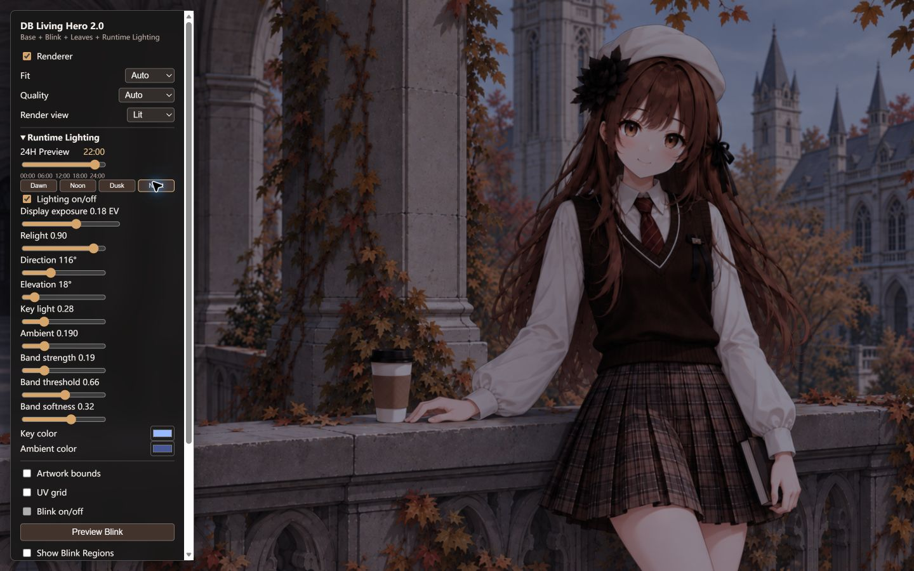

# R2A.4b Night Sky / Upper-Background Compensation Calibration

Status: self-review complete; manual visual acceptance pending. R2B has not started.

## Reference and Scope

The KumengScreen live preview was successfully opened in Edge and inspected at 06:30, 12:00, 17:30, and 22:00. Its night state showed a cool, distinctly lowered upper background while the figure and light clothing remained readable. Dawn kept a cool environment with readable warm light; Noon retained clothing midtones; Dusk separated a warm key from cooler fill. These are relative visual references, not pixel or parameter targets.

Base Albedo, Normal v3, artwork space, Blink, Leaves, slider structure, solar trajectory, sunrise/sunset, and the Vue/engine boundary were unchanged.

## Minimal Mechanism

`upperSceneAttenuation` is a general artwork-space vertical falloff applied only to relit illumination in `src/shaders/hero.frag.glsl`. The mask is `1.0 - smoothstep(0.28, 0.68, v_uv.y)`, so it is strongest at the top and reaches zero smoothly by `v_uv.y = 0.68`. It is not a character mask or hand-painted patch. Dusk uses `0.08`; the night arc reaches `0.54`; Dawn and Noon have no material compensation. Base view and Lighting-off Lit return the sampled Base before this mechanism is evaluated.

## Iterations

### Iteration 1

- Problem: exposed sky and upper background remained too present at Night; further global darkening would lose the character first.
- Change: added the generic `upperSceneAttenuation` state, uniform, and smooth vertical falloff. Night value: `0.58`; Dusk value: `0.08`.
- Result: upper sky and distant architecture settled into a cooler, darker layer while face, shirt, and foreground stone stayed readable. No hard line or obvious blue overlay was visible.

### Iteration 2

- Problem: the first pass solved the structural issue but could be slightly less aggressive.
- Change: reduced `nightUpperSceneAttenuation` from `0.58` to `0.54`; kept Dusk at `0.08` and Dawn/Noon untouched.
- Result: Night retained clear upper-background separation with slightly more surrounding-scene headroom. Dusk remained clearly brighter than Night.

## Final Anchor Diagnostics

Screenshots were captured at 1440x900 in Lit view with the Debug Panel excluded from the artwork diagnostic. Values are linear luminance: mean / p95 / p99. ROI measurements are offline diagnostics only.

| Time | Artwork | Face | White shirt | Background architecture |
| --- | --- | --- | --- | --- |
| 06:30 | .1544 / .4171 / .4912 | .1305 / .4543 / .4976 | .2123 / .4828 / .5273 | .1520 / .3618 / .3816 |
| 12:00 | .2798 / .6269 / .6833 | .2324 / .6602 / .6829 | .3617 / .6768 / .6965 | .2838 / .5274 / .5681 |
| 17:30 | .1261 / .3575 / .4279 | .1111 / .4030 / .4279 | .1801 / .4179 / .4402 | .1172 / .2341 / .2945 |
| 22:00 | .0505 / .1607 / .2137 | .0460 / .1805 / .2002 | .0772 / .2071 / .2267 | .0438 / .1008 / .1231 |

No artwork ROI had near-white pixels. The intended ordering is `Noon > Dawn > Dusk > Night`.

## Core Screenshots

| 06:30 Dawn | 12:00 Noon |
| --- | --- |
|  |  |
| 17:30 Dusk | 22:00 Night |
|  |  |

## Checks and Decision

- 00:00 and 24:00 produce identical artwork pixels in static Lit view; only the Debug status text differs in full screenshots.
- 09:00, 15:00, and 20:00 were checked in Lit view with no visible jump or color discontinuity.
- Base and Lighting-off Lit preserve the shader early Base return path; comparison must use the artwork canvas with identical renderer state because panel text and canvas handoff contaminate a full-frame comparison.
- No Bloom, Emission, system-time synchronization, playback, Breathing, Hair Motion, Leaves v2, or character-specific mask was added.

This is ready for final human visual acceptance. Do not freeze the visual baseline or begin R2B until acceptance is given.
