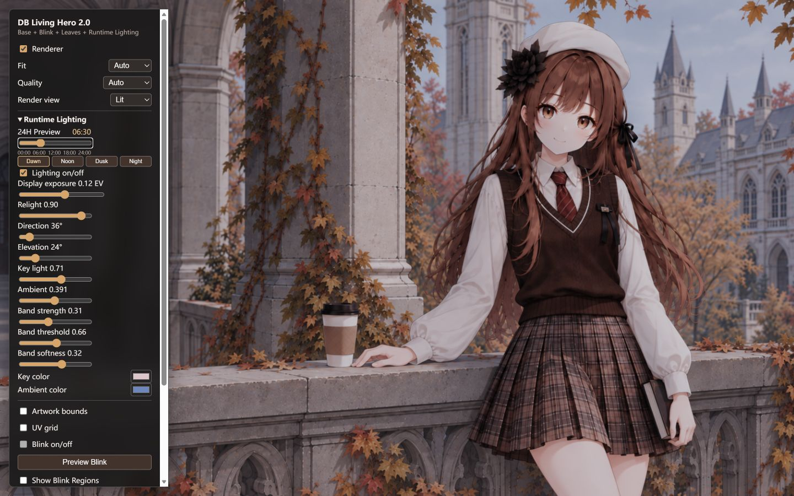
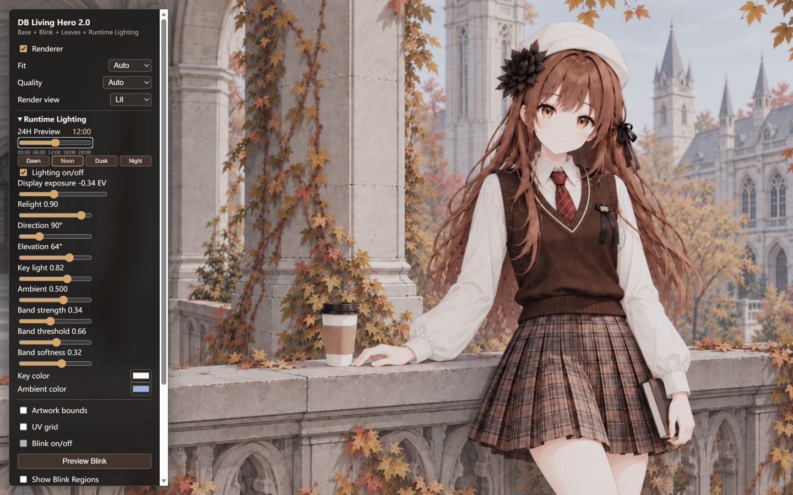
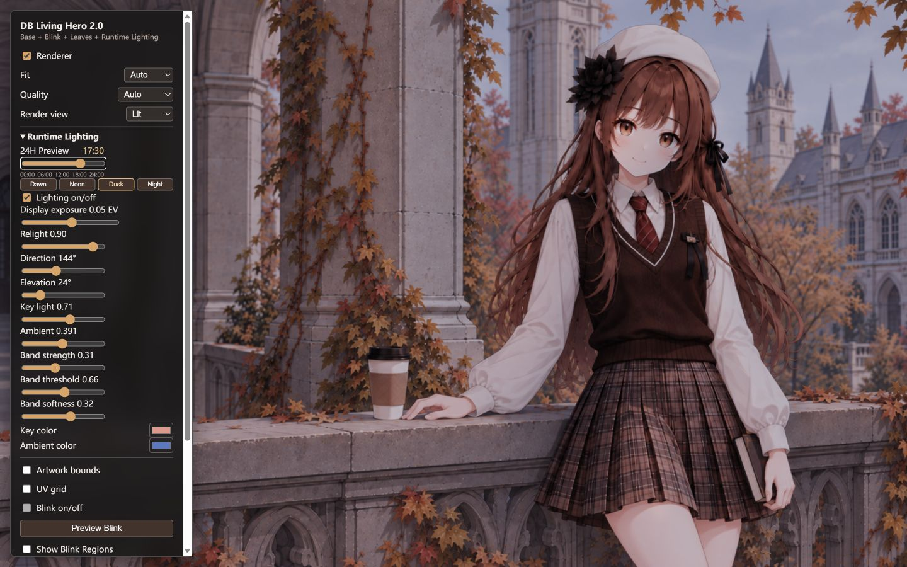
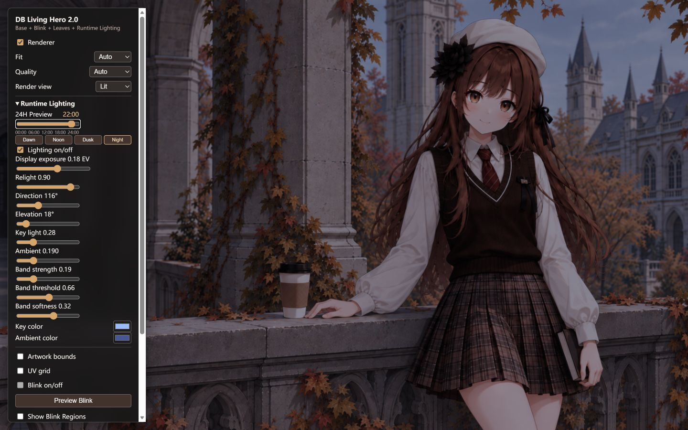

# R2A.4 Reference-Guided Visual Calibration

Status: self-review complete; manual visual acceptance pending. No R2B work was started.

## Reference Review

The live KumengScreen preview was accessible in Edge. Its own 24H controls were used to inspect 06:30, 12:00, 17:30, and 22:00. Dawn has a cool environment and readable figure; Noon is brighter while retaining clothing midtones; Dusk separates warm key from cooler surroundings; Night is distinctly darker yet keeps the face legible. These are relative visual references, not pixel or parameter targets. Source review is in [`../reference/KUMENG_LIGHTING_NOTES.md`](../reference/KUMENG_LIGHTING_NOTES.md).

## Iterations

Two parameter iterations were made against the R2A.3 baseline at 1440x900 in Lit view. An initial capture after Vite hot reload landed in Base view; it was discarded and recaptured.

| Iteration | Problem | Change | Result |
| --- | --- | --- | --- |
| 1 | Dawn felt heavy, Noon slightly washed, Dusk fell toward Night too early. | Dawn exposure `+0.12 -> +0.20 EV`, day exposure `-0.28 -> -0.34 EV`, dusk exposure `-0.08 -> +0.06 EV`; Night unchanged. | Dawn and Dusk gained readability; Noon retained shirt folds. Dawn still felt pink-gray and twilight fill subdued. |
| 2 | Twilight key/fill separation was weak. | Twilight ambient boost `0.26 -> 0.30`; Dawn key `[1,.72,.54] -> [1,.80,.66]`, ambient `[.44,.53,.72] -> [.50,.61,.80]`; Dusk key `[1,.43,.20] -> [1,.48,.24]`, ambient `[.34,.46,.76] -> [.38,.52,.82]`. | Dawn's face, shirt, and masonry became clearer. Dusk gained cool fill while retaining the opposing warm side light. Noon and Night remain unchanged. |

Final config: exposure anchors Dawn `+0.20`, Noon `-0.34`, Dusk `+0.06`, Night `+0.18 EV`; key intensities night/day `0.28/0.82` plus twilight boost `0.58`; ambient night/day `0.19/0.50` plus twilight boost `0.30`. `lightingFor(minutes)` blends these continuously. Sun trajectory, sunrise/sunset, shader, and assets were not changed.

## Final Screenshots

| 06:30 Dawn | 12:00 Noon |
| --- | --- |
|  |  |
| 17:30 Dusk | 22:00 Night |
|  |  |

## Luminance Diagnostic

Run `python scripts/diagnose_lighting_screenshots.py --directory docs/validation/r2a4-final-screenshots --prefix r2a4`. It linearizes screenshot sRGB. `artwork` excludes the Debug Panel (`x=310..1439`); fixed ROIs are offline diagnostics only. Values are mean / p95 / p99 linear luminance.

| Time | Artwork | Face | White shirt | Architecture |
| --- | --- | --- | --- | --- |
| 06:30 | .1544 / .4171 / .4912 | .1305 / .4543 / .4975 | .2123 / .4828 / .5273 | .1521 / .3618 / .3819 |
| 12:00 | .2798 / .6269 / .6833 | .2324 / .6602 / .6829 | .3617 / .6770 / .6968 | .2838 / .5274 / .5681 |
| 17:30 | .1290 / .3641 / .4325 | .1152 / .4160 / .4388 | .1821 / .4199 / .4427 | .1219 / .2418 / .3043 |
| 22:00 | .0531 / .1705 / .2173 | .0501 / .1963 / .2172 | .0790 / .2107 / .2287 | .0473 / .1079 / .1330 |

Ordering: `Noon > Dawn > Dusk > Night`. All artwork and measured ROIs contain 0% near-white (`any RGB channel >= 254`); Noon shirt p99 is `.6968`, with no measured clipping. Full-frame p99 includes white Debug text and is not used for highlight assessment.

## Invariants And Review

00:00, 09:00, 15:00, and 20:00 were checked in Lit view; no visible color or brightness jump was seen. 20:00 is settled into the night state, while 09:00 and 15:00 remain daylight transitions. Captured 00:00 and 24:00 artwork frames matched exactly. With Leaves and Blink disabled for static comparison, Base and Lighting-off Lit artwork RGBA matched pixel-for-pixel (maximum channel difference `0`). An earlier comparison with Leaves moving was discarded.

No obvious embossed face, hard toon boundary, plastic highlight, or shirt clipping was seen in the final screenshots. Dusk remains deeper than Dawn, and this balance merits review on the target display. This is a candidate to freeze, not a frozen visual baseline until manual acceptance. No system clock, playback, Bloom, emission, new masks, or animation work is included.
